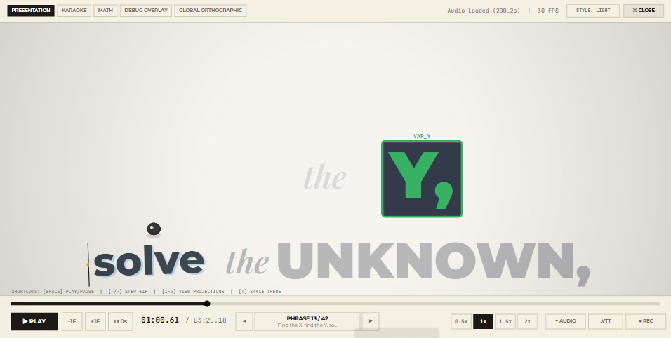
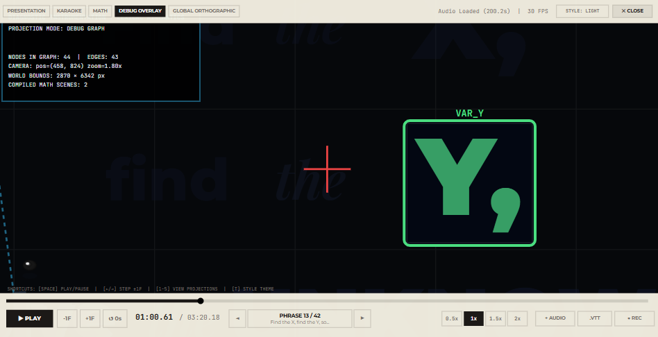

# Kinetics

**A song you can move through.** Kinetics turns timed lyrics into a continuous typographic landscape: words form spatial lockups, the camera travels between them, and mathematical imagery becomes part of the performance.

[Watch the live performance](https://mansfieldplumbing.github.io/kinetics/) · [Explore the choreography](src/choreo.ts) · [Inspect the scene graph](src/graph.ts)



## What is here

This is an interactive lyric performance for an original track by Scott Mansfield. It is not a collection of disconnected effects. The piece has a continuous two-dimensional world, timed word-level emphasis, camera moves, and several ways to view the same choreography.

- **Presentation** follows the camera through the typographic composition.
- **Karaoke** foregrounds the currently sung words.
- **Math** emphasizes the symbolic sequences and equations.
- **Debug overlay** exposes the underlying graph and camera state.
- **Global orthographic** reveals the larger spatial layout.

The on-stage transport can play, pause, seek, change speed, and jump between phrases. You can load local audio or WebVTT subtitles, export subtitles, capture a still, and record a WebM where the browser supports it. Press **Space** to play or pause; the complete shortcuts are shown in the app.



## How the piece works

```text
Timed lyrics + choreography directions
                ↓
      Positioned scene graph
                ↓
  Word, camera, and dot keyframes
                ↓
 Canvas stage + audio-synced transport
```

[`src/choreo.ts`](src/choreo.ts) contains the director's spatial instructions. [`src/graph.ts`](src/graph.ts) builds the connected word layout and animation keyframes. [`src/renderer.ts`](src/renderer.ts) draws the scene; [`src/hud.ts`](src/hud.ts) draws and handles the transport. [`src/main.ts`](src/main.ts) connects those pieces to audio and user input. The supplied performance lives in [`public/`](public/).

The current choreography is authored in source; this is a playable performance and codebase, not yet a graphical keyframe editor.

## Run locally

Install [Bun](https://bun.sh/docs/installation), then from this directory:

```sh
bun ci
bun run dev
```

Open the address printed by Vite. To check and build the production site:

```sh
bun run lint
bun run build
bun run preview
```

The site is static. GitHub Pages builds from the checked-in lockfile and serves the contents of `dist/`; no server-side account or API key is needed for playback.

## Project direction

The long-term native PowerShell appliance belongs in a separate implementation that consumes [QuickPS](https://github.com/MansfieldPlumbing/QuickPS) primitives. This repository preserves the authored performance, spatial graph, and browser reference while that native implementation develops.

Music, lyrics, choreography, and application by Scott Mansfield. All rights reserved unless a file states otherwise.
